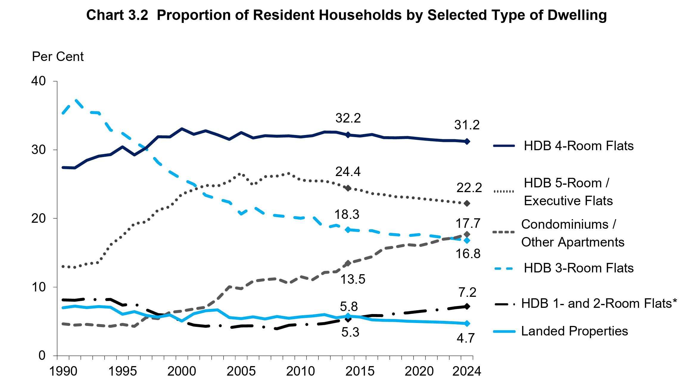
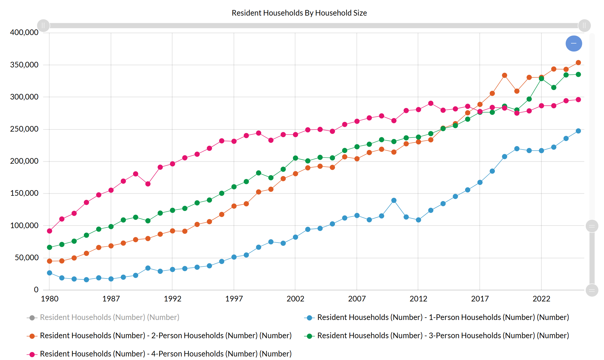
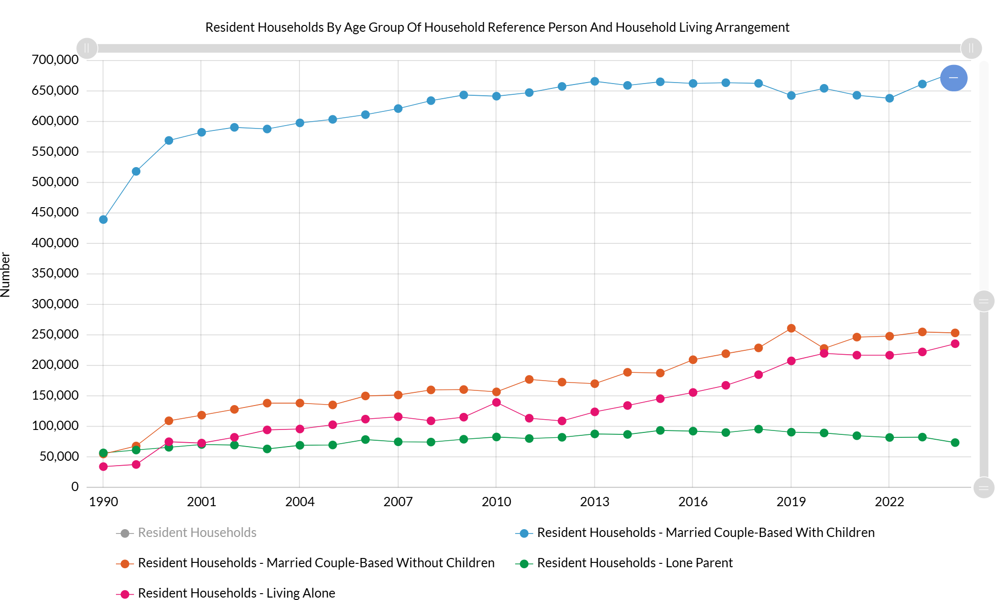
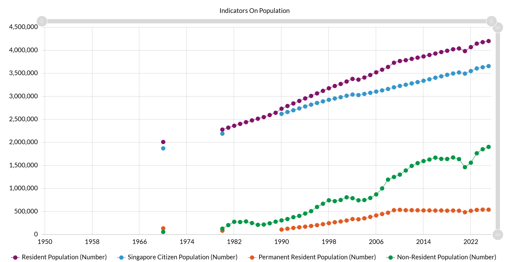
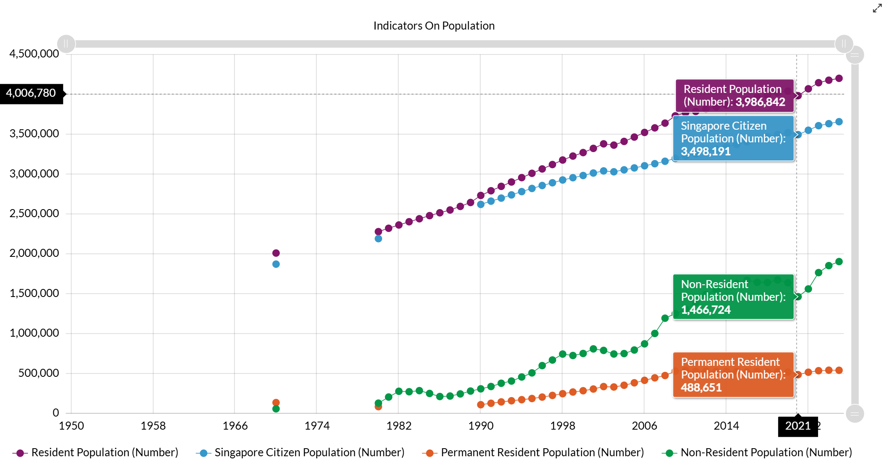
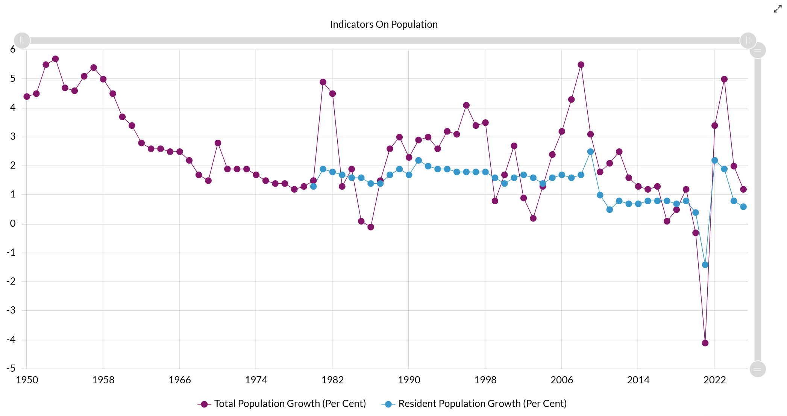
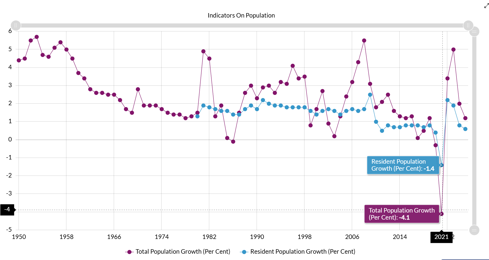
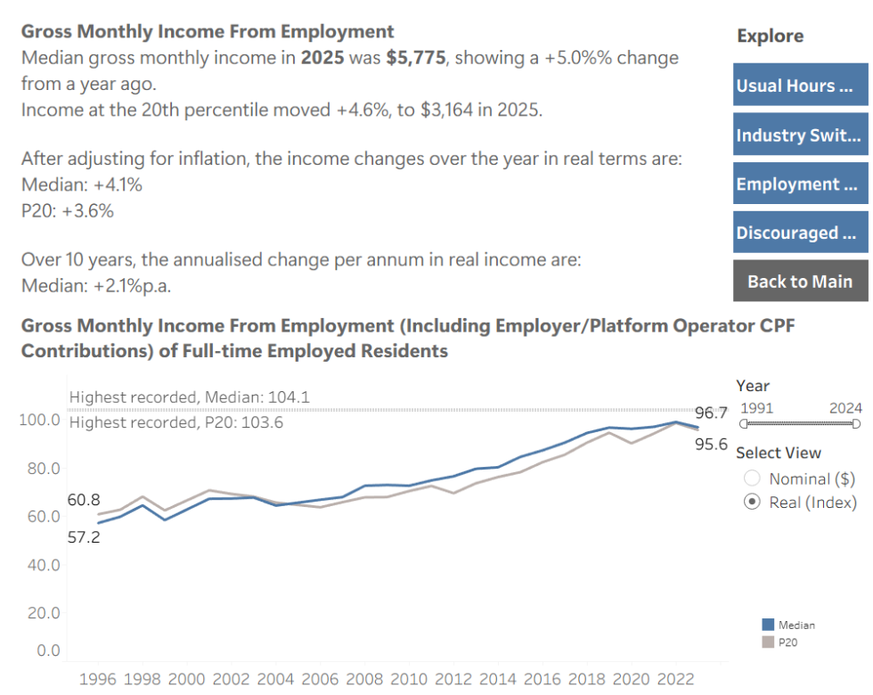

```{r}
#| include: false

library(tidyverse)
library(plotly)
library(htmlwidgets)
library(knitr)
```

# Proposal Deliverables {#sec-show-explain}

The shift in housing composition reflects structural demographic changes, particularly shrinking household sizes. Rather than indicating a contraction in the overall supply of public housing, the gradual movement from larger HDB flats toward private housing appears to align with evolving household structures and living arrangements. This broader demographic transition is documented in the Population Trends 2025 report (Population Trends 2025.pdf) by the Singapore Department of Statistics, which highlights the steady rise in smaller and single-person households over recent decades. 
\
\
As such, this project aims to critically analyse our chosen complex online data visualisation related to the topic, systematically gather and engineer at least four-dimensional supporting data with clear documentation and reproducible code, and redesign the original visualisation to improve its clarity and analytical depth.

## Understanding the chosen visualisation {#sec-understanding}

**Figure 1: Proportion of Resident Households by Selected Type of Dwelling**



The original visualization is a multi-series time-series line chart displaying the proportion (in percent) of resident households living in: HDB 4-room flats; HDB 5-room / Executive flats; HDB 3-room flats; Condominiums and other apartments; Landed properties. The y-axis represents the percentage share of households, while the x-axis represents time (1990–2024).

## Primary Trends Identified {#sec-key-patterns}

- The overall proportion of resident households living in HDB flats declined from 80.4% (2014) to 77.4% (2024).
- HDB 4-room and 5-room/executive flats remain the most prevalent dwelling types, although their shares have gradually decreased.
- Condominium and apartment living increased from 13.5% (2014) to 17.7% (2024).
- Landed property residence decreased from 5.8% to 4.7% over the same period.

## Original Data Dimensions and Categories {#sec-data-dimensions}

### Time and Population {#sec-time-population}

- **Year:** The specific calendar year of the record.
- **Resident Households:** The total percentage of households living in Singapore.

### Housing Breakdown {#sec-housing-breakdown}

- **1- and 2-Room Flats:** Small-format public housing.
- **3-Room Flats:** Mid-sized public housing.
- **4-Room Flats:** Standard family-sized public housing.
- **5-Room & Executive Flats:** Large-format and premium public housing.
- **Condominiums & Other Apartments:** Private non-landed housing.
- **Landed Properties:** Houses with direct land titles (e.g. terraces, bungalows).

The dataset dimensions are: **Year**, **Resident Households**, **Total HDB Dwellings**, **HDB 1- and 2-Room Flats**, **HDB 3-Room Flats**, **HDB 4-Room Flats**, **HDB 5-Room and Executive Flats**, **Condominiums and Other Apartments**, **Landed Properties**, and **Other Types of Dwelling**. The data for the rest of the columns except Year is represented in absolute counts, from which percentage shares are derived.

# Original Chart {#sec-original-chart}

The chart below shows all dwelling categories in a single interactive time series. Use the start and end year controls to change the date range.

<style>
.chart-container {
  width: 100%;
  max-width: 100%;
  margin: 1em 0;
  padding: 1em 0;
  background-color: #ffffff;
  box-sizing: border-box;
  overflow: hidden;
}

.date-range-controls {
  display: flex;
  justify-content: center;
  align-items: center;
  gap: 15px;
  margin-bottom: 1em;
  padding: 12px;
  background-color: #f8f9fa;
  border-radius: 8px;
  box-shadow: 0 2px 4px rgba(0,0,0,0.08);
}

.date-range-controls label {
  font-weight: 600;
  color: #333;
  margin-right: 5px;
}

.date-range-controls input[type="number"] {
  padding: 8px 12px;
  border: 2px solid #ddd;
  border-radius: 4px;
  font-size: 14px;
  width: 100px;
  transition: border-color 0.3s;
  box-sizing: border-box;
}

.date-range-controls input[type="number"]:focus {
  outline: none;
  border-color: #4CAF50;
}

.date-range-controls button {
  padding: 8px 20px;
  background-color: #4CAF50;
  color: white;
  border: none;
  border-radius: 4px;
  cursor: pointer;
  font-size: 14px;
  font-weight: 600;
  transition: background-color 0.3s;
}

.date-range-controls button:hover { background-color: #45a049; }
.date-range-controls button:active { background-color: #3d8b40; }

.plotly {
  width: 100% !important;
  max-width: 100% !important;
  height: 560px !important;
  margin: 0 auto;
}

.plot-container {
  width: 100%;
  max-width: 100%;
  height: 560px;
  margin: 0 auto;
  padding: 0;
  box-sizing: border-box;
  overflow: hidden;
}
</style>

<div class="chart-container">
<div class="date-range-controls">
  <label for="startYear">Start Year:</label>
  <input type="number" id="startYear" min="1980" max="2024" value="1980">
  <label for="endYear">End Year:</label>
  <input type="number" id="endYear" min="1980" max="2024" value="2024">
  <button onclick="updateChartRange()">Update Range</button>
</div>

```{r}
# Load data, pivot to long format, and compute percentage shares relative to total resident households.
data <- read.csv("data.csv", check.names = FALSE)

data_long <- data %>%
  pivot_longer(
    cols = -`Data Series`,
    names_to = "Year",
    values_to = "Value"
  ) %>%
  mutate(
    Year = as.numeric(Year),
    Series = trimws(`Data Series`)
  ) %>%
  filter(!is.na(Value) & Series != "Total HDB Dwellings")

total_households <- data_long %>%
  filter(Series == "Resident Households") %>%
  select(Year, Total = Value)

data_long <- data_long %>%
  left_join(total_households, by = "Year") %>%
  mutate(Percent = (Value / Total) * 100) %>%
  filter(Series != "Resident Households")

min_year <- min(data_long$Year, na.rm = TRUE)
max_year <- max(data_long$Year, na.rm = TRUE)

blue_shades <- c(
  "#08306b", "#2171b5", "#4292c6", "#6baed6", "#9ecae1",
  "#c6dbef", "#deebf7"
)
line_styles <- c("solid", "dot", "dash", "solid", "dot", "dash", "longdash")

series_names <- unique(data_long$Series)
p <- plot_ly(width = NULL, height = 560)

for (i in seq_along(series_names)) {
  d <- data_long %>% filter(Series == series_names[i])
  p <- p %>%
    add_trace(
      data = d,
      x = ~Year,
      y = ~Percent,
      type = "scatter",
      mode = "lines+markers",
      name = series_names[i],
      line = list(width = 2.5, color = blue_shades[i], dash = line_styles[i]),
      marker = list(size = 5, color = blue_shades[i]),
      hovertemplate = paste0("<b>", series_names[i], "</b><br>Year: %{x}<br>Percent: %{y:.2f}%<extra></extra>")
    )
}

p <- p %>%
  layout(
    title = list(
      text = "(Original Chart) Proportion of Resident Households by Selected Type of Dwellings",
      x = 0.5,
      font = list(size = 18, color = "#333")
    ),
    xaxis = list(title = "Year", range = c(min_year, max_year), tickmode = "linear", dtick = 5),
    yaxis = list(title = "Percent (%)", tickformat = ".1f"),
    hovermode = 'x unified',
    legend = list(orientation = "v", x = 1.02, y = 0.5, font = list(size = 11)),
    margin = list(l = 80, r = 200, t = 80, b = 80),
    plot_bgcolor = 'rgba(0,0,0,0)',
    paper_bgcolor = 'rgba(0,0,0,0)'
  ) %>%
  config(displayModeBar = FALSE, displaylogo = FALSE) %>%
  htmlwidgets::onRender("
    function(el, x) {
      window.plotlyChartDiv = el;
      window.updateChartRange = function() {
        var startYear = parseInt(document.getElementById('startYear').value);
        var endYear = parseInt(document.getElementById('endYear').value);
        
        // Validate Range
        if (startYear > endYear) { 
          alert('Start year must be less than or equal to end year'); 
          return; 
        }
        if (startYear < 1980 || endYear > 2024) { 
          alert('Year range must be between 1980 and 2024'); return; }
        
        // Calculate appropriate tick interval based on range
        var rangeSize = endYear - startYear;
        var dtick;
        if (rangeSize <= 5) {
          dtick = 1;
        } else if (rangeSize <= 10) {
          dtick = 2;
        } else if (rangeSize <= 20) {
          dtick = 5;
        } else {
          dtick = 5;
        }
        
        // Update the chart
        Plotly.relayout(el.id, {
          'xaxis.range': [startYear, endYear],
          'xaxis.dtick': dtick
        });
      };
    }
  ")

p
```

The story this chart tells is one of gradual structural change in Singapore's housing composition. The overall proportion of resident households in HDB flats declined from 80.4% in 2014 to 77.4% in 2024, while condominium and apartment living rose from 13.5% to 17.7% over the same period. This shift appears to be driven less by a reduction in public housing supply and more by demographic changes, particularly shrinking household sizes and changing living arrangements, as documented in the Singapore Department of Statistics Population Trends 2025 report.
</div>

# Improved Chart (Small Multiples) {#sec-small-multiples}

Five small aligned charts: **HDB 3-room**, **HDB 4-room**, **HDB 5-room**, **Condo**, **Landed**. Same x-axis (Year) and same y-axis (%). Blue tones = Public (HDB); warm tones = Private. Use the date filter below to set the range.

<div class="chart-container" style="margin-top: 2rem;">
<div class="date-range-controls">
  <label for="startYear2">Start Year:</label>
  <input type="number" id="startYear2" min="1980" max="2024" value="1980">
  <label for="endYear2">End Year:</label>
  <input type="number" id="endYear2" min="1980" max="2024" value="2024">
  <button onclick="updateChartRange2()">Update Range</button>
</div>

```{r improved-chart}
# 5 small multiples — HDB 3, 4, 5-room, Condo, Landed. Same x, same y (%). Date filter applied.
opt_a_series <- c("HDB 3-Room Flats", "HDB 4-Room Flats", "HDB 5-Room And Executive Flats", "Condominiums And Other Apartments", "Landed Properties")
opt_a_titles <- c("HDB 3-room", "HDB 4-room", "HDB 5-room", "Condo", "Landed")
opt_a_colors <- c("#2171b5", "#4292c6", "#6baed6", "#c6531a", "#e6864a")

make_opt_a <- function(series_name, title, color) {
  d <- data_long %>% filter(Series == series_name)
  last_pt <- d %>% slice_max(Year, n = 1) %>% slice(1)
  plot_ly(d, x = ~Year, y = ~Percent, type = "scatter", mode = "lines", line = list(width = 2, color = color),
    hovertemplate = paste0("<b>", title, "</b><br>Year: %{x}<br>Percent: %{y:.2f}%<extra></extra>")) %>%
    layout(
      title = list(text = title, font = list(size = 12)),
      xaxis = list(range = c(min_year, max_year), dtick = 5),
      yaxis = list(title = "%", tickformat = ".1f"),
      margin = list(t = 36, b = 32, l = 44, r = 80),
      showlegend = FALSE,
      annotations = list(
        list(
          x = last_pt$Year, y = last_pt$Percent, text = title,
          showarrow = FALSE, xanchor = "left", xref = "x", yref = "y",
          font = list(size = 10, color = color), cliponaxis = FALSE
        )
      )
    )
}
plist_a <- lapply(1:5, function(i) make_opt_a(opt_a_series[i], opt_a_titles[i], opt_a_colors[i]))
p2 <- subplot(plist_a, nrows = 5, margin = 0.02, shareX = TRUE, shareY = TRUE) %>%
  layout(
    title = list(text = "(Improved Chart) Small multiples (same x, same y %)", x = 0.5, font = list(size = 14)),
    plot_bgcolor = "rgba(0,0,0,0)", paper_bgcolor = "rgba(0,0,0,0)"
  ) %>%
  config(displayModeBar = FALSE, displaylogo = FALSE) %>%
  htmlwidgets::onRender("
    function(el, x) {
      window.updateChartRange2 = function() {
        var startYear = parseInt(document.getElementById('startYear2').value);
        var endYear = parseInt(document.getElementById('endYear2').value);
        if (startYear > endYear) { alert('Start year must be less than or equal to end year'); return; }
        if (startYear < 1980 || endYear > 2024) { alert('Year range must be between 1980 and 2024'); return; }
        var dtick = (endYear - startYear) <= 5 ? 1 : ((endYear - startYear) <= 10 ? 2 : 5);
        Plotly.relayout(el.id, {
          'xaxis.autorange': false,
          'xaxis.range': [startYear, endYear],
          'xaxis.dtick': dtick
        });
      };
    }
  ")
p2
```

</div>

<script>
// Allow Enter key to trigger update
document.addEventListener('DOMContentLoaded', function() {
  var startInput2 = document.getElementById('startYear2');
  var endInput2 = document.getElementById('endYear2');
  
  if (startInput2) {
    startInput2.addEventListener('keypress', function(e) {
      if (e.key === 'Enter' && typeof window.updateChartRange2 === 'function') {
        window.updateChartRange2();
      }
    });
  }
  
  if (endInput2) {
    endInput2.addEventListener('keypress', function(e) {
      if (e.key === 'Enter' && typeof window.updateChartRange2 === 'function') {
        window.updateChartRange2();
      }
    });
  }
});
</script>

# Analytical Design Efficiency {#sec-strengths-weaknesses}

## Strengths {#sec-strengths}

### Multivariate Comparison Across Housing Types

The chart plots six dwelling categories on a common set of axes, enabling direct cross-category comparison within a single view. This aligns with Tufte's (1983) broader advocacy for multivariate displays that invite the viewer to reason about relationships in the data, rather than examining each variable in isolation. The viewer can immediately observe, for example, that the decline in HDB 3-Room flat proportions has been accompanied by a corresponding rise in condominium and other private apartment ownership.

### Extended Temporal Coverage

The chart spans approximately 33 years (1990–2023), providing sufficient temporal depth to reveal long-term structural shifts, such as the sustained decline in HDB 3-Room flat residence (from approximately 35.0% to 17.0%) and the gradual rise of condominiums (from roughly 7% to 17.2%). A shorter time window of five to ten years would obscure these trends and potentially lead to misleading interpretations of what are slow-moving demographic transitions.

### Appropriate Chart Type for Continuous Temporal Data

The use of a point-to-point (line) chart is well-suited for displaying proportional change over a continuous time axis. Line charts are the recommended format when the data involve trends over time, particularly when a non-zero baseline might otherwise be needed. Unlike bar charts, where area can mislead, lines communicate direction and rate of change without introducing area-based distortion. This choice is consistent with the course's guidance on matching chart type to data characteristics.

## Weaknesses {#sec-weaknesses}

### Visual Clutter Due to Overlapping Trend Lines

With six categories plotted simultaneously, the chart suffers from significant visual congestion, particularly in the 1995–2005 region where multiple lines converge and intersect. This impedes the viewer's ability to trace any single category across the full time span. Tufte (1990) emphasises the importance of layering and separation, where the principle states that distinct data series should be visually distinguishable even where they overlap. In this chart, the dense intersection of lines undermines that objective.

### Separated Legend Requiring Excessive Visual Referencing

The legend is positioned to the right of the chart area rather than integrated directly with the data lines. This forces the viewer to perform repeated cross-referencing: identify a line's pattern, retain it in working memory, locate the corresponding entry in the legend, and return to the line to continue reading the trend. Tufte (1983) advocates for placing labels directly on or adjacent to the data they describe, thereby reducing cognitive overhead and enabling more fluent interpretation. For example, direct labelling where each line is annotated at its endpoint would substantially improve readability.

### Excessive Reliance on Line-Pattern Encoding

The chart employs six distinct line patterns (solid, dotted, dashed, and mixed combinations) to differentiate the categories. Where lines converge, particularly in the congested central region, these patterns become difficult to distinguish, requiring the reader to expend disproportionate effort on decoding rather than analysis. While the line patterns serve a functional encoding purpose, their proliferation in a crowded chart effectively reduces the signal-to-noise ratio. A more effective approach might employ colour differentiation, small multiples (faceted panels), or direct annotations to reduce this perceptual burden.

### Monochrome Palette with Pattern Encoding Disadvantages Print and Accessibility

The chart uses a black-and-blue colour scheme with varying dash patterns; while functional in a printed government report, it creates difficulties for colourblind readers and reduces distinguishability when photocopied or viewed on a greyscale screen. The two blue lines (HDB 3-Room Flats and Landed Properties) are particularly close in hue, and the reliance on dash-pattern differentiation compounds this issue. A more accessible design might employ a broader colour palette with distinct hues and sufficient contrast ratios.

### Absence of Gridlines Impedes Precise Reading

The chart provides no horizontal or vertical gridlines, making it difficult for the reader to extract approximate values at any point other than the two annotated years. For example, identifying the exact year when Condominiums overtook HDB 3-Room Flats (a significant crossover visible around 2020–2022) requires guesswork. Light reference gridlines would assist the reader in locating values without adding substantial visual noise, and their omission reduces the chart's usefulness as a reference tool.

# Proposed Improvements {#sec-proposed-improvements}

The **Improved Chart (Small Multiples)** in this report implements the following improvements in response to the weaknesses of the original visualisation:

**Small multiples (one series per panel)**  
Instead of plotting all six dwelling categories in a single chart, the improved chart uses five aligned panels—one for each of HDB 3-room, HDB 4-room, HDB 5-room, Condominiums, and Landed properties. Each panel has the same x-axis (Year) and the same y-axis (percent), so trends can be compared across panels without overlapping lines. This removes visual clutter and makes it easier to trace any single category over the full time span (Tufte's layering and separation).

**Simplified line styles and coordinated colour palette**  
All series use solid lines only (no dotted or dashed patterns), reducing the decoding effort that the original chart required. Dwelling types are differentiated by colour: shades of blue for public housing (HDB 3-, 4-, and 5-room) and warm colours (orange tones) for private housing (Condo, Landed). This improves distinguishability for screen and print and supports better accessibility than the original monochrome palette with pattern encoding.

**Direct labelling (no separate legend)**  
Each panel has the series name (e.g. "HDB 3-room", "Condo") annotated directly at the end of the line, so the viewer does not need to cross-reference a legend. This reduces cognitive load and aligns with Tufte's recommendation to place labels on or adjacent to the data they describe.

**Interactive date-range filter**  
Start Year and End Year controls (with an "Update Range" button and Enter-key support) allow the user to focus on a chosen time window (e.g. 1995–2005 or 2010–2024). Narrowing the range makes it easier to read values and compare series without relying on gridlines, and the same filter applies across all five panels so comparison remains consistent.

**Contextual annotations**  
Contextual annotations (e.g. light vertical event markers or short text for policy or supply milestones) could be added to explain *why* certain trends occur—for example, why the HDB 3-room share fell sharply in the 90s. See [HDB: Design through the decades](https://www.hdb.gov.sg/about-us/history/design-through-the-decades) for candidate milestones.

# Data Sources {#sec-data-sources}

From the original visualization, it is noted that the analysis indicates that the move towards private housing + 1 & 2 room flats arose mainly from household size shrinking, instead of a decline in the overall supply of public housing, highlighting shifts in demographic structures in Singapore. While this is true, it is to note that there are several factors beyond what is shown in the original visualization that also contribute to such shifts, some of which include broader population dynamics, supply-side structural changes as well as financial growth. As such, we sought to integrate these factors as part of the improvement to the original diagram in order to produce a more well-rounded and in-depth visualization that can provide more value and clarity to readers. The data sources below are used to contextualize these factors.

## Population Dynamics {#sec-data-population}

### Household Sizes {#sec-data-household-sizes}

This refers to the shift from collective family structures to smaller living arrangements. Main indicators include: **Shrinking Households**. Findings have shown [1]: experts interviewed by CNA agreed that housing demand remains elevated despite a falling birth rate, largely because of demographic and lifestyle changes. One major trend, they said, is a “significant mindset shift” towards forming smaller or single-person households ([CNA: Housing demand](https://www.channelnewsasia.com/singapore/housing-demand-population-ura-master-plan-5224401)).

Referring to [SingStat Table M810371](https://tablebuilder.singstat.gov.sg/table/TS/M810371), we can notice a largely increasing trend in 2-person & 1-person households, whereas the number of 5-person households has been generally decreasing over the years.



In another news article [2], findings have shown that the share of one-person homes rose to 15.6 per cent in 2023/2024, up from 12.6 per cent in 2018 and 7.1 per cent in 2003, according to the Housing and Development Board's (HDB) sample household survey released on Thursday (Nov 27). These findings reflect societal shifts such as an ageing population and changing housing preferences, said HDB in the 12th edition of the survey since it started in 1968 ([CNA: One-person homes](https://www.channelnewsasia.com/singapore/proportion-one-person-homes-up-shrinking-household-sizes-hdb-survey-5491071))

#### Rising Trend of Living Alone/ Married without Children

The trend in shrinking households can be further explained through the growing demographic trends in households of singles living alone or rather those that are married without children. \
\
\
As mentioned by this article [3], it is found that more people, especially working professionals who are not planning for a family at the moment, are drawn towards smaller units which are more common within condo developments as property developers are cutting up condominium developments into a bigger number of small units to keep it affordable for potential buyers ([Straits Times: Smaller homes](https://www.straitstimes.com/life/youre-not-imagining-it-singapore-homes-are-getting-smaller)). 
\
\
This also arose due to larger homes being priced at a premium which can only be afforded by high-income households, which are usually unlikely to be single-person households. 
\
\
As such, the alternative, as done by one such professional Mr Jon Phua, has been to purchase a one-bedroom shoebox condominium unit in Hougang, which allowed him to work away from the compact confines of his parents' 4-room HDB flat, as well as not having to wait until he turned 35 to get his own HDB flat. As such, many people share similar sentiments to Mr Jon Phua and it is estimated that "the number of singles, seniors and households with one or no child is likely to increase in the years ahead," according to Mr Lee Sze Teck, senior director of data analytics at real estate agency Huttons Asia. 
\
\
Adding on, we can refer to [SingStat Table M810651](https://tablebuilder.singstat.gov.sg/table/TS/M810651), where we can notice a rising trend of resident households living alone as well as those married without children.



### Composition of Non-Residents {#sec-data-non-residents}

This refers to the growth in the composition of non-residents in Singapore, which has largely contributed to that of the growth of Singapore’s entire population. It has been noted by Dr Woo Jun Jie, senior lecturer at the Lee Kuan Yew School of Public Policy, who researches urban governance [1], that this growth has contributed largely in driving demand for private housing, including those for purchase and rental ([CNA: Housing demand](https://www.channelnewsasia.com/singapore/housing-demand-population-ura-master-plan-5224401)). Referring to [SingStat Table M810001](https://tablebuilder.singstat.gov.sg/table/TS/M810001), we can observe a jump in the non-resident population from 2021 to 2025.





Additionally, as we refer to the indicator on population growth (per cent), we observe the total population growth making a sharp jump but resident population growth only contributed to less than half of that growth. From what we have observed in the previous chart, the proportion of growth in non-residents have been higher than that of permanent residents in the same time frame (2021 to 2025), hence we can assume that the larger driver of the total population growth can be attributed to non-residents, which further supports our research.





## Finance Growth {#sec-data-finance}

**Rise in Gross Monthly Income (from employment)**  
Labour Force and income statistics are available from the [MOM Labour Force Dashboard 2025](https://stats.mom.gov.sg/Pages/Dashboard-Labour-Force-in-Singapore-2025.aspx) and [Labour Force Report 2025](https://stats.mom.gov.sg/Pages/Labour-Force-In-Singapore-2025.aspx). The steady rise in real median income strengthens the purchasing power of residents, enabling more households to transition toward private property. This upward financial trajectory underpins the sustained demand for high-end housing like condominiums as aspirations for home ownership evolve alongside wage growth.



### Project data files {#sec-data-files}

The report uses the following CSV files: `data.csv` (dwelling-type counts), `Resident Household by household.csv`, `Living Alone Married without Ch.csv`, `Composition of Non-Residents.csv`, `hdb_resale_prices.csv`, and `Gross monthly income.csv`. Percentages in the charts are computed relative to total resident households for each year. Full citations: Singapore Department of Statistics (SingStat), HDB sample household survey, Housing & Development Board (HDB) Resale Flat Prices dataset, and MOM Labour Force Report.

# Data Engineering Pipeline {#sec-data-workflow}

The pipeline processes data across four phases: extraction, cleaning and normalisation, feature engineering, and integration into a master analytical table. All five CSV files are used, and the common join key across all sources is **Year**.

## Phase 1: Multi-Source Extraction & Schema Mapping {#sec-phase1}

Four data silos are loaded and mapped to a common schema.

| Silo | Source | Action |
|------|--------|--------|
| **A (Core Housing)** | [SingStat Table M810351](https://tablebuilder.singstat.gov.sg/table/TS/M810351) (Resident Households by Dwelling)| Convert absolute counts to **percentage shares** to match the original visualisation. |
| **B (Demographics)** | [SingStat Table M810371](https://tablebuilder.singstat.gov.sg/table/TS/M810371) (Household Size) & [SingStat Table M810651](https://tablebuilder.singstat.gov.sg/table/TS/M810651) (Living Arrangements) | Extract **"1-person"** and **"Married w/o Children"** as new feature columns. |
| **C (Population)** | [SingStat Table M810001](https://tablebuilder.singstat.gov.sg/table/TS/M810001) (Residency Status) | Calculate the **Non-Resident Ratio** (Non-Residents / Total Population). |
| **D (Economics)** | MOM Labour Force Report 2025 | Extract **Median Monthly Income** and deflate using CPI to get **Real Income Growth**. |

### Silo A: Core Housing
```{r, echo=TRUE}
silo_a_wide <- read.csv("data.csv", check.names = FALSE)
year_cols <- setdiff(names(silo_a_wide), "Data Series")
years <- as.numeric(year_cols)
```

### Silo B: Resident Household Size (Demographics)
#### Resident Household by household.csv — 1-person, 2-person, total, avg household size
```{r, echo=TRUE}
# (Demographics): Resident Household by household.csv — 1-person, 2-person, total, avg household size
hh_wide <- read.csv("Resident Household by household.csv", check.names = FALSE)
hh_year_cols <- setdiff(names(hh_wide), "Data Series")
hh_long <- hh_wide %>%
  mutate(Series = trimws(`Data Series`)) %>%
  pivot_longer(cols = all_of(hh_year_cols), names_to = "Year", values_to = "Value") %>%
  mutate(Year = as.numeric(Year), Value = as.numeric(gsub(",", "", as.character(Value))))
```

**Extract 1-person, 2-person, Resident Households (Number), Average Household Size**
```{r, echo=TRUE}
hh_total    <- hh_long %>% filter(Series == "Resident Households (Number)") %>% select(Year, total_hh = Value)
hh_1p       <- hh_long %>% filter(Series == "1-Person Households (Number)") %>% select(Year, one_person = Value)
hh_2p       <- hh_long %>% filter(Series == "2-Person Households (Number)") %>% select(Year, two_person = Value)
hh_avg_size <- hh_long %>% filter(Series == "Average Household Size Among Resident Households (Persons)") %>% select(Year, avg_household_size = Value)

silo_b_from_hh <- hh_total %>%
  left_join(hh_1p, by = "Year") %>% left_join(hh_2p, by = "Year") %>%
  mutate(
    one_person_household_pct = if_else(total_hh > 0, 100 * one_person / total_hh, NA_real_),
    two_person_household_pct = if_else(total_hh > 0, 100 * two_person / total_hh, NA_real_),
    shrinkage_index = if_else(total_hh > 0, (one_person + two_person) / total_hh, NA_real_)
  ) %>%
  left_join(hh_avg_size, by = "Year") %>%
  select(Year, one_person_household_pct, two_person_household_pct, shrinkage_index, avg_household_size)
```

#### Living Alone & Married w/o Children: Living Alone Married without Ch.csv
```{r, echo=TRUE}
alone_wide <- read.csv("Living Alone Married without Ch.csv", check.names = FALSE) %>% slice(2:7)
alone_year_cols <- setdiff(names(alone_wide), "Data Series")
alone_long <- alone_wide %>%
  mutate(Series = trimws(`Data Series`)) %>%
  pivot_longer(cols = all_of(alone_year_cols), names_to = "Year", values_to = "Value") %>%
  mutate(Year = as.numeric(Year), Value = as.numeric(as.character(Value)))

living_alone  <- alone_long %>% filter(Series == "Living Alone") %>% select(Year, living_alone = Value)
married_no_ch <- alone_long %>% filter(Series == "Married Couple-Based Without Children") %>% select(Year, married_no_children = Value)
```

**Sparse year gaps - Linear Interpolation to full-range**
```{r, echo=TRUE}
y_range <- min(silo_b_from_hh$Year, na.rm = TRUE):max(silo_b_from_hh$Year, na.rm = TRUE)
living_alone_full  <- approx(living_alone$Year, living_alone$living_alone, xout = y_range, rule = 2) %>% as_tibble() %>% rename(Year = x, living_alone = y)
married_no_ch_full <- approx(married_no_ch$Year, married_no_ch$married_no_children, xout = y_range, rule = 2) %>% as_tibble() %>% rename(Year = x, married_no_children = y)
```

**Joining of full-range years to create final Silo B table**
```{r, echo=TRUE}
silo_b <- silo_b_from_hh %>%
  full_join(living_alone_full, by = "Year") %>%
  full_join(married_no_ch_full, by = "Year") %>%
  arrange(Year) %>%
  filter(Year %in% years)
```

### Silo C: Non-Resident Population Ratio
```{r, echo=TRUE}
pop_wide <- read.csv("Composition of Non-Residents.csv", check.names = FALSE)
pop_year_cols <- setdiff(names(pop_wide), "Data Series")
pop_long <- pop_wide %>%
  mutate(Series = trimws(`Data Series`), across(all_of(pop_year_cols), as.character)) %>%
  pivot_longer(cols = all_of(pop_year_cols), names_to = "Year", values_to = "Value") %>%
  mutate(Year = as.numeric(Year), Value = as.numeric(Value))

total_pop   <- pop_long %>% filter(Series == "Total Population (Number)") %>% select(Year, total_pop = Value)
non_res_pop <- pop_long %>% filter(Series == "Non-Resident Population (Number)") %>% select(Year, non_resident = Value)
silo_c <- total_pop %>%
  left_join(non_res_pop, by = "Year") %>%
  mutate(non_resident_ratio = if_else(total_pop > 0 & !is.na(non_resident), non_resident / total_pop, NA_real_)) %>%
  select(Year, non_resident_ratio) %>%
  filter(Year %in% years)
```

### Silo D: Income 
**2025 median only; other years modelled via index**
```{r, echo=TRUE}
inc_raw <- read.csv("Gross monthly income.csv", check.names = FALSE, comment.char = "")
total_row <- which(inc_raw[[1]] == "Total")[1]
if (is.na(total_row) || length(total_row) == 0) total_row <- 11L
inc_vals <- suppressWarnings(as.numeric(gsub(",", "", unlist(inc_raw[total_row, 3:ncol(inc_raw)]))))
median_2025 <- if (length(inc_vals) > 0 && !all(is.na(inc_vals))) inc_vals[1] else NA_real_

silo_d <- tibble(Year = years) %>%
  mutate(
    median_income_nominal = if_else(Year == 2025, median_2025, NA_real_),
    median_income_index   = if_else(Year == 2025 & !is.na(median_2025), 100, NA_real_),
    condo_price_index     = 100 * exp(0.035 * (Year - 1990) / 10)
  )
```

**Carry-forward income index for display (no CPI in CSVs)**
```{r, echo=TRUE}
silo_d <- silo_d %>% mutate(median_income_index = if_else(is.na(median_income_index), 100 * exp(0.03 * (Year - 1990) / 10), median_income_index))
```

## Phase 2: Data Cleaning & Normalization (The "Long" Pivot) {#sec-phase2}

- **Pivot to long format:** Most SingStat tables are **wide** (years as columns). For analysis and visualisation, pivot all sources into **long** format (e.g. `Year`, `Variable`, `Value`).
- **Standardisation:** Ensure housing types are named **identically** across datasets (e.g. "Condos" in one table must match "Condominiums and Other Apartments" in another).
- **HDB survey gap:** HDB surveys (e.g. 15.6% one-person home stat) are **periodic** (e.g. 2018, 2023). For years in between, use **linear interpolation** to estimate values, or **carry-forward** logic to maintain a continuous series.

```{r pipeline-phase2, echo=TRUE}
# ========== Phase 2: Data Cleaning & Normalization (Long Pivot + Standardize) ==========

# Pivot Silo A to long; standardize series names
series_std <- c(
  "Resident Households" = "Resident Households",
  "Total HDB Dwellings" = "Total HDB Dwellings",
  "HDB 1- And 2-Room Flats" = "HDB 1- And 2-Room Flats",
  "HDB 3-Room Flats" = "HDB 3-Room Flats",
  "HDB 4-Room Flats" = "HDB 4-Room Flats",
  "HDB 5-Room And Executive Flats" = "HDB 5-Room And Executive Flats",
  "Condominiums And Other Apartments" = "Condominiums And Other Apartments",
  "Landed Properties" = "Landed Properties",
  "Other Types Of Dwelling" = "Other Types Of Dwelling"
)

silo_a_long <- silo_a_wide %>%
  pivot_longer(cols = all_of(year_cols), names_to = "Year", values_to = "Value") %>%
  mutate(
    Year = as.numeric(Year),
    Series = trimws(`Data Series`),
    Series = recode(Series, !!!series_std)
  ) %>%
  filter(!is.na(Value))

# Total households for shares
total_households <- silo_a_long %>% filter(Series == "Resident Households") %>% select(Year, Total = Value)

# Housing shares (Silo A action: counts -> percentage shares)
housing_shares <- silo_a_long %>%
  filter(Series != "Total HDB Dwellings") %>%
  left_join(total_households, by = "Year") %>%
  mutate(share_pct = (Value / Total) * 100) %>%
  filter(Series != "Resident Households") %>%
  select(Year, Series, share_pct)

# Interpolation helper for gaps (e.g. periodic HDB survey years)
interpolate_gaps <- function(tbl, year_col = "Year", value_col = "value") {
  tbl_ord <- tbl %>% arrange(!!sym(year_col))
  yrs <- tbl_ord[[year_col]]
  vals <- tbl_ord[[value_col]]
  full_years <- min(yrs):max(yrs)
  interp <- approx(yrs, vals, xout = full_years, rule = 2)
  tibble(!!sym(year_col) := interp$x, !!sym(value_col) := interp$y)
}
```

## Phase 3: Feature Engineering {#sec-phase3}

Derived metrics are created to explain the *why* behind the trends, not only plot raw data.

- **Shrinkage Index:** Ratio of **(1- and 2-person households) / (Total households)**. Used as a primary explanatory variable for rising condo demand (smaller households favour smaller units / private housing).
- **NR Impact Factor:** Annual **% change of Non-Residents**. Tag years where growth > 3% as **"High External Demand"** periods.
- **Affordability Ratio:** **Median Income / Average Condo Price**. Supports the "finance growth" narrative—showing that even as prices rise, rising wages (Silo D) can sustain demand.

```{r pipeline-phase3, echo=TRUE}
# ========== Phase 3: Feature Engineering ==========

# Silo B: shrinkage_index from Phase 1; add married_no_children_pct from counts / total households
silo_b_eng <- silo_b %>%
  left_join(total_households, by = "Year") %>%
  mutate(
    married_no_children_pct = if_else(!is.na(Total) & Total > 0 & !is.na(married_no_children), 100 * married_no_children / Total, NA_real_)
  )

# NR Impact Factor: annual % change of non-residents; tag High External Demand if growth > 3%
silo_c_eng <- silo_c %>%
  arrange(Year) %>%
  mutate(
    nr_pct_change = (non_resident_ratio / lag(non_resident_ratio) - 1) * 100,
    high_external_demand = replace_na(nr_pct_change > 3, FALSE)
  )

# Affordability Ratio: Median Income / Condo Price (indices)
silo_d_eng <- silo_d %>%
  mutate(affordability_ratio = median_income_index / condo_price_index)

# Floor-area index and supply-compression flag
# silo_e_eng <- silo_e_overall %>%
#   arrange(Year) %>%
#   mutate(
#     floor_area_pct_change = (avg_floor_area_sqm / lag(avg_floor_area_sqm) - 1) * 100,
#     floor_area_index = 100 * avg_floor_area_sqm / first(avg_floor_area_sqm),
#     supply_compression = replace_na(floor_area_pct_change < -2, FALSE)
#   )
```

## Phase 4: Integration {#sec-phase4}

Merge all engineered features into a single **Master Analytical Table**. The final schema should align all series and derived variables on **[Year]** so that time-series charts and correlation analyses use one consistent table.

### Pipeline implementation (R code with Explanations)

The following code implements Phases 1–4 using **all five CSV files**: `data.csv` (Silo A), `Resident Household by household.csv` and `Living Alone Married without Ch.csv` (Silo B), `Composition of Non-Residents.csv` (Silo C), and `Gross monthly income.csv` (Silo D). Where a source has gaps (e.g. Living Alone has only selected years), the pipeline uses interpolation or carry-forward.

```{r pipeline-phase4, echo=TRUE}
# ========== Phase 4: Integration — Master Analytical Table ==========

# Wide housing shares for one row per year (key series only for schema)
housing_wide <- housing_shares %>%
  filter(Series %in% c(
    "HDB 3-Room Flats", "HDB 4-Room Flats", "HDB 5-Room And Executive Flats",
    "Condominiums And Other Apartments", "Landed Properties"
  )) %>%
  pivot_wider(names_from = Series, values_from = share_pct, names_repair = "unique")

master_table <- Reduce(
  function(x, y) left_join(x, y, by = "Year"),
  list(
    housing_wide,
    silo_b_eng %>% select(Year, one_person_household_pct, two_person_household_pct, married_no_children_pct, shrinkage_index, avg_household_size),
    silo_c_eng %>% select(Year, non_resident_ratio, nr_pct_change, high_external_demand),
    silo_d_eng %>% select(Year, median_income_nominal, median_income_index, condo_price_index, affordability_ratio)
  )
)

# Schema: one row per Year; columns from all silos + engineered features
master_schema <- tibble(
  Column = names(master_table),
  Type = if_else(names(master_table) == "Year", "integer", "numeric")
)
```

```{r pipeline-show, echo=FALSE}
# Show Master Table schema and first/last rows
knitr::kable(master_schema, caption = "Master Analytical Table schema (Phase 4)")
knitr::kable(head(master_table, 5), caption = "Master table (first 5 years)")
knitr::kable(tail(master_table, 5), caption = "Master table (last 5 years)")
```

The pipeline produces a **Master Analytical Table** (`master_table`) with one row per **Year** and columns from all silos plus engineered features. All five project CSVs are used: **Silo A** from `data.csv`; **Silo B** from `Resident Household by household.csv` (1-/2-person shares, shrinkage index, average household size) and `Living Alone Married without Ch.csv` (living alone and married-without-children counts, interpolated to full year range); **Silo C** from `Composition of Non-Residents.csv` (non-resident ratio); **Silo D** from `Gross monthly income.csv` (2025 median income; other years use an index for pipeline continuity). Condo price index remains synthetic (no CSV in project)

---

The following **ETL summary** maps the same pipeline to Extract / Transform / Load / Quality. These subsections are **redundant with Phases 1–4** above; they are kept as a short reference. For a minimal report, they could be removed and the phase narratives would suffice.

## Extract {#sec-workflow-extract}

*(Corresponds to **Phase 1**.)*

- **Silo A:** `data.csv` — dwelling-type counts by year; `Data Series` plus year columns; read with `check.names = FALSE` to preserve year column names.
- **Silo B:** `Resident Household by household.csv` (1-/2-person counts, total resident households, average household size); `Living Alone Married without Ch.csv` (top-level block only: Living Alone, Married Couple-Based Without Children), with interpolation to full year range.
- **Silo C:** `Composition of Non-Residents.csv` — Total Population and Non-Resident Population; year columns coerced to character before pivot to avoid mixed-type errors.
- **Silo D:** `Gross monthly income.csv` — 2025 median from the "Total" row; no time series in file.

## Transform {#sec-workflow-transform}

*(Corresponds to **Phase 2** and **Phase 3**.)*

- **Phase 2:** Pivot all wide silos to long (`Year`, series identifier, `Value`). Standardise series names (`trimws()`, recode to canonical labels). Compute **housing shares** (count / Resident Households × 100). Use `interpolate_gaps()` for sources with missing years (e.g. Living Alone). Exclude *Total HDB Dwellings* and *Resident Households* from dwelling-type shares.
- **Phase 3:** **Shrinkage index** from Silo B (1- + 2-person) / total; **married_no_children_pct** from Living Alone file counts / total households. **NR impact:** annual % change of non-resident ratio; flag **high_external_demand** when growth > 3%. **Affordability ratio:** median_income_index / condo_price_index.
**Floor-area index** from Silo E: mean `floor_area_sqm` per lease year, indexed to earliest year (= 100); flag **supply_compression** when year-over-year decline > 2%. **Small-flat supply share:** proportion of 1-, 2-, and 3-ROOM transactions per lease year.

## Load / Consume {#sec-workflow-load}

*(Corresponds to **Phase 4** plus report output.)*

- **Load:** Phase 4 builds the **Master Analytical Table** (`master_table`) in memory via `left_join(..., by = "Year")` of housing shares (wide), Silo B/C/D engineered columns; one row per year.
- **Consume:** The report shows the master schema and head/tail in a kable table. Charts use the long **housing shares** from Phase 2 (same denominator per year). Report is rendered to a single HTML (Quarto, `embed-resources: true`); charts are **plotly** (original: one trace per series; improved: 5-panel small multiples with direct labels and date filter). Dependencies: `tidyverse`, `plotly`, `htmlwidgets`, `knitr`, Quarto.

## Quality checks (implicit) {#sec-workflow-quality}

- **Extract:** Type handling for mixed year columns (e.g. Silo C `as.character` before pivot); parsing "na" and commas in CSVs to numeric where needed.
- **Transform:** Dropping `NA` in `Value`; `trimws()` on series names; shares from a single denominator per year; interpolation for sparse years.
- **Join:** All silos aligned on **Year**; missing years in one source yield NA in that column (e.g. income only 2025).

# Team Work Distribution {#sec-work-distribution}

| Admin Number | Name | Task |
|------|--------|--------|
| 2402319 | SIM EN QI | • Data Sources<br> |
| 2402844 | CORVAN CHUA | • <br>• <br> |
| 2502218 | SOH JIA HUI (SU JIAHUI) | • <br>• <br>|
| 2501484 | AVRIL LEONG KE EN | • <br>• <br> |
| 2501222 | KOK YI HENG | • |

# Summary {#sec-summary}

This report showed an original multivariate time-series chart of dwelling-type proportions and an improved chart (five small multiples with same x and y %, and date filter). Use the date-range controls on each chart to focus on specific years.

# References {#sec-references}

- [CNA — Housing demand, population, URA master plan](https://www.channelnewsasia.com/singapore/housing-demand-population-ura-master-plan-5224401) [1]
- [CNA — Proportion of one-person homes up, shrinking household sizes (HDB survey)](https://www.channelnewsasia.com/singapore/proportion-one-person-homes-up-shrinking-household-sizes-hdb-survey-5491071) [2]
- [Straits Times — Singapore homes are getting smaller](https://www.straitstimes.com/life/youre-not-imagining-it-singapore-homes-are-getting-smaller) [3]
- [HDB — Design through the decades](https://www.hdb.gov.sg/about-us/history/design-through-the-decades)
- [MOM — Labour Force in Singapore 2025 (Dashboard)](https://stats.mom.gov.sg/Pages/Dashboard-Labour-Force-in-Singapore-2025.aspx)
- [MOM — Labour Force in Singapore 2025 (Report)](https://stats.mom.gov.sg/Pages/Labour-Force-In-Singapore-2025.aspx)
- Singapore Department of Statistics, *Population Trends 2025* (PDF).

- Singapore Department of Statistics. (Household Size)
[SingStat Table M810371](https://tablebuilder.singstat.gov.sg/table/TS/M810371)

- Singapore Department of Statistics. (Living Arrangements) 
[SingStat Table M810651](https://tablebuilder.singstat.gov.sg/table/TS/M810651)

- Singapore Department of Statistics. (Residency/ Composition of Non-Residents)
[SingStat Table M810001](https://tablebuilder.singstat.gov.sg/table/TS/M810001)

- Singapore Department of Statistics.(Resident Households by Dwelling). 
[SingStat Table M810351](https://tablebuilder.singstat.gov.sg/table/TS/M810351)